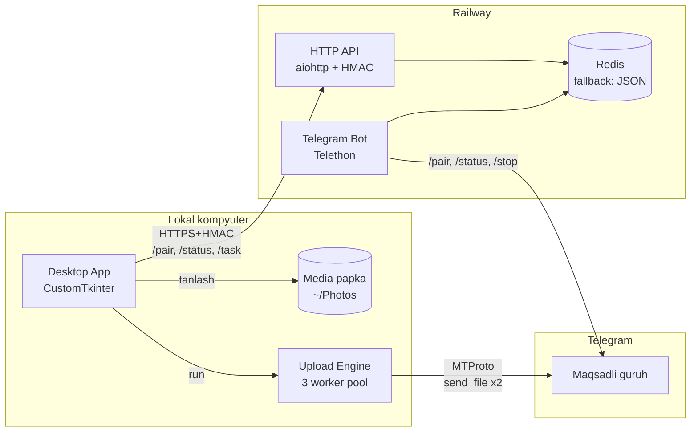
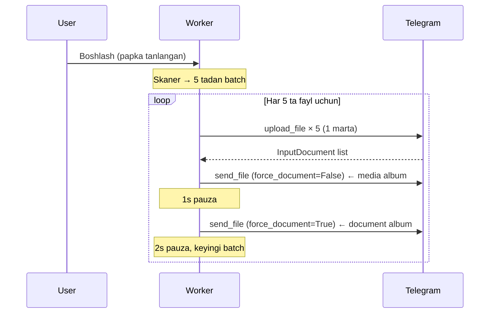
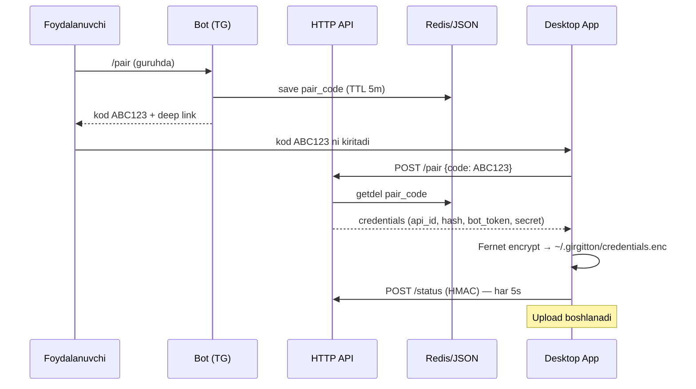

# Architecture — Girgitton v3.0

## High-level diagram

## Yuborish algoritmi (single-upload, dual-send)

## Komponent qatlamlari

| Qatlam       | Modul                                           | Vazifa                                                       |
| ------------ | ----------------------------------------------- | ------------------------------------------------------------ |
| `core`       | `config`, `models`, `errors`, `logging_setup`   | Domen-pure: ramka-mustaqil DTO va konfiguratsiya             |
| `shared`     | `crypto`, `media`, `repositories`               | Bot va App o'rtasida umumiy yordamchilar                     |
| `storage`    | `base`, `redis_store`, `json_store`, `factory`  | `StorageRepository` Protocol + ikki adapter                  |
| `bot`        | `client`, `handlers/*`, `api/*`                 | Telethon hodisalari + aiohttp HTTP API                       |
| `app`        | `gui/*`, `upload/*`, `api_client`, `config_store` | CustomTkinter GUI + 3-worker upload engine                |
| `platform`   | `windows`, `macos`                              | OS-specific kod (deep link, keyring fallback)                |

## Data flow — pair flow

## Worker pool va rotatsiya

3 mezonli rotatsiya har worker uchun:

1. **Soni** — har `ROTATE_AFTER_N_BATCHES` (15) batchdan keyin sessiya yangilanadi
2. **Vaqt** — `ROTATE_AFTER_SECONDS` (300) oshib ketsa
3. **Tezlik** — oxirgi 3 batch o'rtacha tezligi `SPEED_DROP_THRESHOLD_MB_S` (0.10) dan past

Throttle aniqlanganda (oxirgi batch < `THROTTLE_SPEED_LIMIT_MB_S`):

- GUI dialog ochiladi (countdown + manual retry)
- `THROTTLE_WAIT_SECONDS` (1800) kutiladi
- Sessiya majburiy yangilanadi
